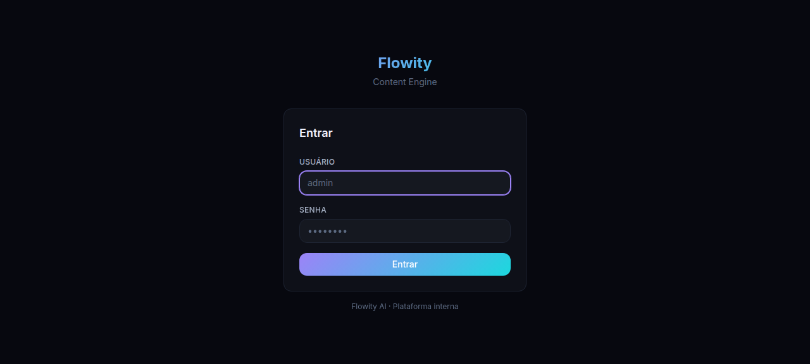
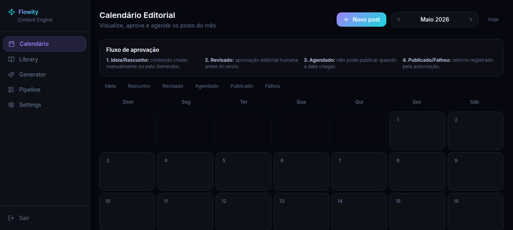
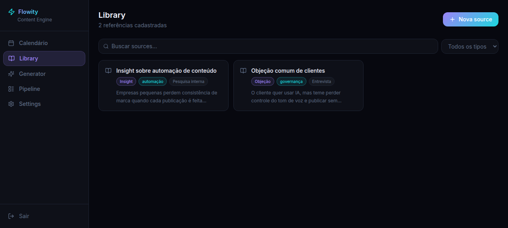
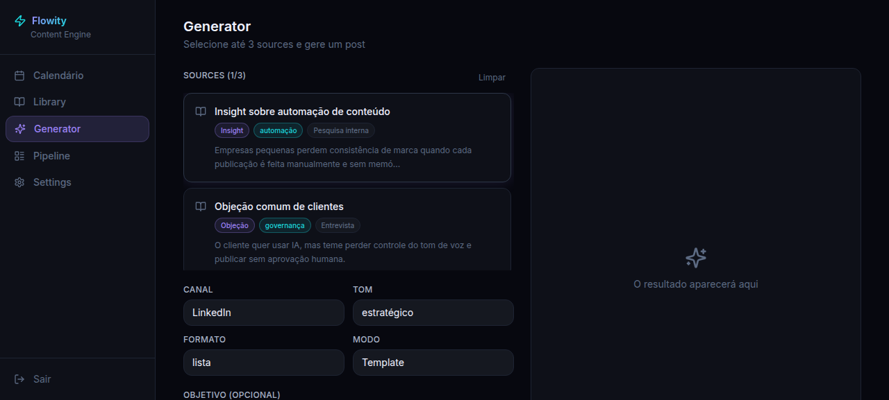
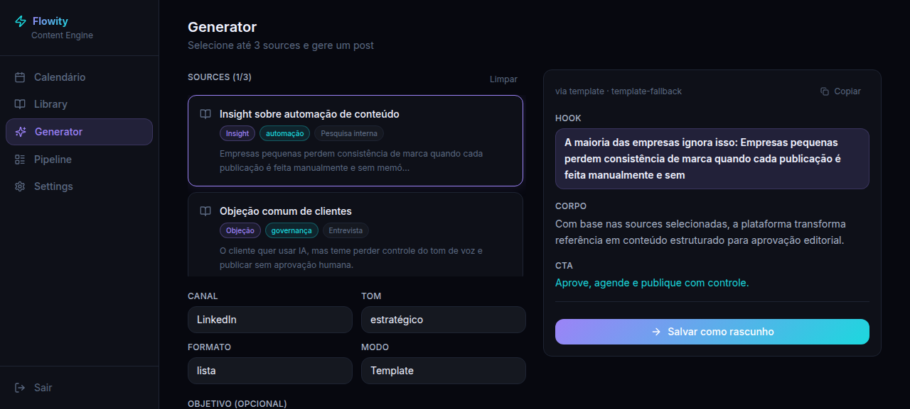
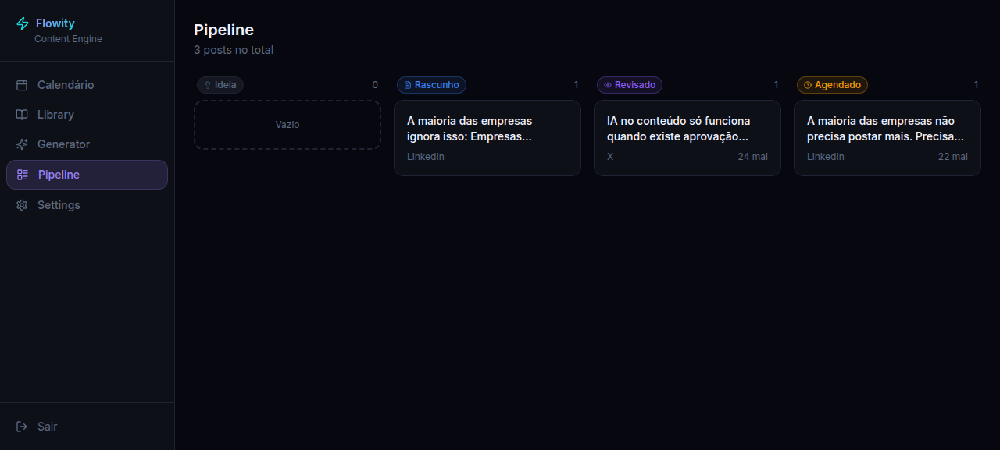
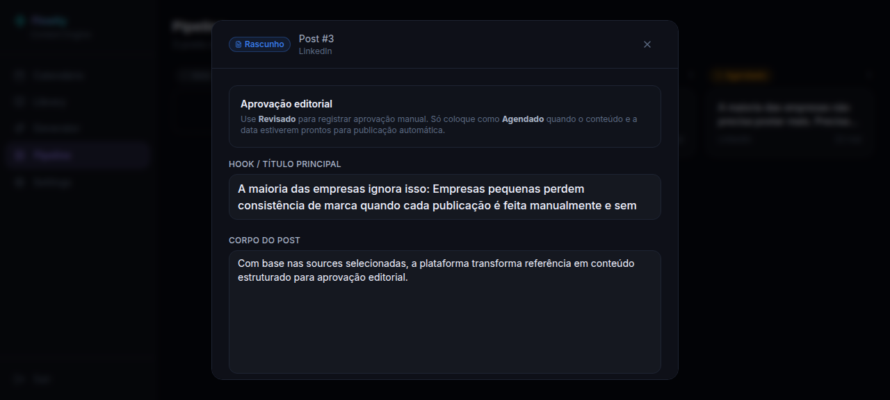
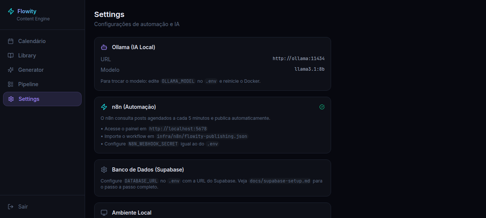

# Funcionamento da Plataforma — Flowity Content Engine

## Objetivo do sistema

O Flowity Content Engine é uma plataforma interna desenvolvida para apoiar o processo de produção, revisão, agendamento e publicação de conteúdos digitais da Flowity AI. A solução centraliza referências editoriais, gera rascunhos com apoio de IA, organiza o fluxo de aprovação humana e integra automações para publicação programada.

O fluxo foi estruturado para atender ao contexto do Projeto Integrador, demonstrando uma aplicação web com frontend, backend, banco de dados, inteligência artificial local e automação por workflow.

---

## Imagem 01 — Login e controle de acesso

A primeira etapa do uso da plataforma é a autenticação do usuário administrador. A tela de login restringe o acesso ao ambiente interno, garantindo que apenas usuários autorizados possam visualizar, criar, revisar ou agendar conteúdos.

O login envia as credenciais ao backend, que valida o usuário administrador e retorna um token JWT. Esse token é armazenado no navegador e passa a acompanhar as próximas requisições feitas pela interface.

---

## Imagem 02 — Calendário editorial e fluxo de aprovação

Após o login, o usuário acessa o calendário editorial. Essa tela apresenta a visão mensal dos conteúdos e explica o fluxo operacional da plataforma:

1. **Ideia/Rascunho:** o conteúdo é criado manualmente ou gerado pelo módulo de IA.
2. **Revisado:** o conteúdo passa por aprovação humana antes de qualquer publicação.
3. **Agendado:** após revisão e definição de data, o conteúdo fica disponível para publicação automática.
4. **Publicado/Falhou:** a automação registra o resultado da tentativa de publicação.

Esse fluxo evita que a IA publique diretamente sem controle editorial, mantendo uma etapa humana de revisão antes do envio automático.

---

## Imagem 03 — Biblioteca de referências

A biblioteca, chamada de **Library**, armazena as referências utilizadas para geração de conteúdo. Cada referência pode representar um insight, objeção de cliente, trecho de pesquisa, frase, comentário ou material externo.

Essas fontes funcionam como matéria-prima editorial. Ao cadastrar referências, o time mantém uma base organizada para que os posts sejam gerados com contexto e coerência. A tela também possui busca e filtro por tipo de source, facilitando a localização das informações.

---

## Imagem 04 — Configuração da geração de conteúdo

No módulo **Generator**, o usuário seleciona até três referências da biblioteca e define os parâmetros de geração:

- canal de publicação, como LinkedIn ou X;
- tom do conteúdo;
- formato textual;
- modo de geração, por template ou por IA local via Ollama;
- objetivo opcional do post.

Essa etapa transforma referências brutas em uma solicitação estruturada para criação do conteúdo.

---

## Imagem 05 — Resultado gerado e salvamento como rascunho

Após executar a geração, a plataforma apresenta uma prévia do conteúdo produzido, dividida em hook, corpo e CTA. O usuário pode copiar o texto ou salvar o resultado como rascunho.

Ao salvar como rascunho, o post passa a existir no banco de dados e entra no pipeline editorial. Nesse momento, ele ainda não está aprovado nem pronto para publicação automática.

---

## Imagem 06 — Pipeline editorial

O pipeline organiza os posts por status. Ele permite acompanhar visualmente em que etapa cada conteúdo se encontra:

- Ideia;
- Rascunho;
- Revisado;
- Agendado;
- Publicado.

O post criado no Generator aparece na coluna **Rascunho**, enquanto conteúdos já aprovados ou agendados aparecem em suas respectivas etapas. Essa visão facilita o acompanhamento do trabalho editorial e reduz o risco de publicar conteúdos sem revisão.

---

## Imagem 07 — Modal de revisão, aprovação e agendamento

Ao clicar em um post, a plataforma abre um modal de edição. Nele, o usuário pode revisar o hook, corpo, CTA, versão para X, canal, status, data de agendamento e observações internas.

A regra principal do processo é que o status **Revisado** representa aprovação humana. Somente depois dessa validação o post deve ser alterado para **Agendado**, com data e hora definidas. A partir desse estado, a automação pode identificar o post como pronto para publicação.

---

## Imagem 08 — Configurações de IA e automação

A tela **Settings** apresenta as integrações técnicas da plataforma:

- **Ollama:** responsável pela geração local com modelo de IA, como `llama3.1:8b`.
- **n8n:** responsável pela automação de publicação dos posts agendados.
- **Supabase/Database URL:** responsável pela persistência dos dados em ambiente produtivo ou local.

O workflow do n8n deve ser importado a partir de `infra/n8n/flowity-publishing.json`. Ele consulta periodicamente os posts agendados, tenta realizar a publicação e devolve ao backend o resultado da operação.

---

## Fluxo completo de funcionamento

O funcionamento ponta a ponta da plataforma segue a sequência abaixo:

1. O administrador acessa o sistema com login protegido por JWT.
2. O usuário cadastra referências editoriais na Library.
3. O Generator usa essas referências para gerar uma proposta de post.
4. O conteúdo gerado é salvo como rascunho.
5. O rascunho aparece no Pipeline editorial.
6. O usuário revisa manualmente o conteúdo e altera o status para Revisado.
7. O usuário define data/hora e altera o status para Agendado.
8. O n8n consulta os posts agendados e executa a tentativa de publicação.
9. O backend registra o resultado como Publicado ou Falhou.
10. O calendário e o pipeline refletem o estado atualizado do conteúdo.

---

## Considerações finais

A plataforma demonstra uma arquitetura integrada entre interface web, API, banco de dados, geração assistida por IA e automação. O principal diferencial do fluxo é manter a IA como apoio à produção, sem eliminar a aprovação humana antes da publicação.

Dessa forma, o sistema combina produtividade, controle editorial e rastreabilidade, características importantes para uma ferramenta profissional de gestão de conteúdo digital.
